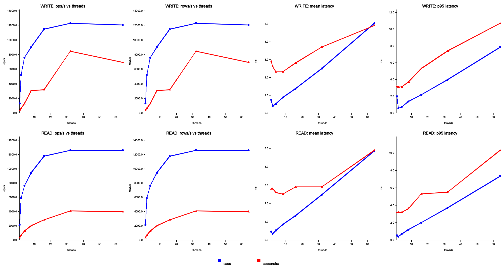
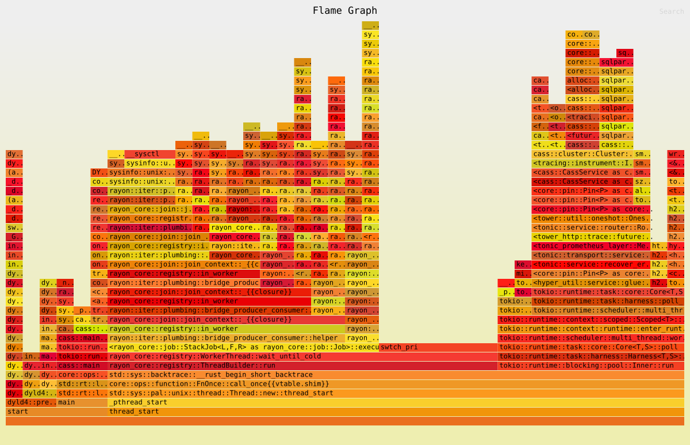

# Cass

[](https://github.com/mweiden/cass/actions/workflows/ci.yml) [](https://codecov.io/gh/mweiden/cass)

Toy/experimental clone of [Apache Cassandra](https://en.wikipedia.org/wiki/Apache_Cassandra) written in Rust, mostly using [OpenAI Codex](https://chatgpt.com/codex).

`cass` is a distributed, horizontally scalable key-value store with a SQL-ish
query layer. It stores data in a [log-structured merge
tree](https://en.wikipedia.org/wiki/Log-structured_merge-tree), replicates
partitions across a gossip-managed ring, and serves queries over gRPC — with
tunable read consistency, hinted handoff, read repair, and Paxos-style
lightweight transactions.

## Quickstart

Start a five-node cluster (replication factor 3) with Prometheus, Grafana, and
Jaeger:

```bash
docker compose up
```

Then open a REPL against any node and run some queries:

```bash
cargo run -- repl http://localhost:8080
```

```
> CREATE TABLE orders (customer_id TEXT, order_id TEXT, order_date TEXT, PRIMARY KEY(customer_id, order_id))
CREATE TABLE 1 table
> INSERT INTO orders VALUES ('nike', 'abc123', '2025-08-25')
INSERT 1 row
> SELECT * FROM orders WHERE customer_id = 'nike'
  customer_id order_date  order_id
0 nike        2025-08-25  abc123
(1 rows)
```

The cluster exposes nodes on ports `8080`–`8084`, Grafana on
<http://localhost:3000> (`admin`/`admin`), and Jaeger on
<http://localhost:16686>.

## Contents

- [Features](#features)
- [Query Syntax](#query-syntax) — [primary keys](#primary-keys), [lightweight transactions](#lightweight-transactions-compare-and-set)
- [Running Cass](#running-cass) — [install](#install), [server options](#server-options), [storage backends](#storage-backends), [cluster](#running-a-cluster), [maintenance](#maintenance-commands)
- [How It Works](#how-it-works) — [architecture](#architecture), [module map](#module-map), [design tradeoffs](#design-tradeoffs), [consistency](#consistency-hinted-handoff-and-read-repair)
- [Operations](#operations) — [monitoring](#monitoring), [tracing](#distributed-tracing)
- [Benchmarking](#benchmarking) — [performance comparison](#performance-comparison), [flamegraphs](#flamegraph-profiling)
- [Development](#development)

## Features

- **gRPC API and CLI** for submitting SQL queries — see [`proto/cass.proto`](proto/cass.proto) for the service definition
- **Data structure:** stores data in a [log-structured merge tree](https://en.wikipedia.org/wiki/Log-structured_merge-tree)
- **Storage:** sorted string tables (SSTables) with bloom filters, zone maps, and a sparse index to skip unnecessary reads; persists to local disk or S3
- **Durability / recovery:** sharded write-ahead logs for durability and in-memory tables for parallel ingestion
- **Deployment:** Dockerfile and docker-compose for containerized deployment and local testing
- **Scalability:** horizontally scalable
- **Gossip:** cluster membership and liveness detection via gossip with health checks
- **Consistency:** tunable read replica count with hinted handoff and read repair
- **Lightweight transactions:** for compare-and-set operations

## Query Syntax

The built-in SQL engine understands a small subset of SQL:

- `INSERT` of a `key`/`value` pair into a table
- `UPDATE` and `DELETE` statements targeting a single key
- `SELECT` with optional `WHERE` filters, `ORDER BY`, `GROUP BY`,
  `DISTINCT`, simple aggregate functions (`COUNT`, `MIN`, `MAX`, `SUM`)
  and `LIMIT`
- Table management statements such as `CREATE TABLE`, `DROP TABLE`,
  `TRUNCATE TABLE`, and `SHOW TABLES`
- Lightweight transactions (compare-and-set):
  - `INSERT ... IF NOT EXISTS`
  - `UPDATE ... IF col = value` (simple equality predicates)

### Primary Keys

Note on creating [partition and clustering keys](https://cassandra.apache.org/doc/4.0/cassandra/data_modeling/intro.html#partitions):
the first column in `PRIMARY KEY(...)` will be the partition key, subsequent columns will be indexed as clustering keys.

So for the example `id` will be the partition key and `c` will be a clustering key:

```sql
CREATE TABLE t (
   id int,
   c text,
   k int,
   v text,
   PRIMARY KEY (id,c)
);
```

The partition key determines which replicas own the row — it is hashed onto the
[ring](#architecture) to pick the replica set.

### Lightweight Transactions (Compare-and-Set)

Cass supports [Cassandra-style lightweight
transactions](https://docs.datastax.com/en/cql-oss/3.3/cql/cql_using/useInsertLWT.html)
for conditional writes using a Paxos-like protocol across the partition's
replicas. Two forms are supported:

- `INSERT ... IF NOT EXISTS` — inserts only when the row does not exist.
- `UPDATE ... IF col = value [AND col2 = value2 ...]` — applies the update only
  if all equality predicates match the current row.

Response shape mirrors Cassandra:

- On success: a single row with `[applied] = true`.
- On failure: a single row with `[applied] = false` and the current values for
  the columns referenced in the `IF` clause.

```
> UPDATE orders SET order_date = '2025-08-27'
    WHERE customer_id = 'nike' AND order_id = 'abc123' IF order_date = '2025-08-25'
  [applied]
0 true
(1 rows)

> UPDATE orders SET order_date = '2025-08-28'
    WHERE customer_id = 'nike' AND order_id = 'abc123' IF order_date = '2025-08-25'
  [applied] order_date
0 false     2025-08-27
(1 rows)
```

Consistency for LWT is QUORUM and does not depend on the server's read
consistency setting. Normal reads continue to use the configured server-level
read consistency (ONE/QUORUM/ALL via `--read-consistency`).

Notes:

- The `IF` clause is parsed only when it appears as a trailing clause outside
  of quotes or comments (e.g., `-- comment`). Using the word "if" inside data
  values or identifiers does not trigger LWT behavior.

## Running Cass

### Prerequisites

- A recent Rust toolchain (the project uses edition 2024; the Docker build pins
  1.89). No separate `protoc` install is needed — [`build.rs`](build.rs)
  vendors it.
- Docker and Docker Compose, for the example cluster and the benchmark harness.

### Install

Build and run straight from the repo:

```bash
cargo run -- server          # start the gRPC server on port 8080
```

Or install the `cass` binary onto your `PATH`, which is what the rest of this
README assumes when it writes `cass ...`:

```bash
cargo install --path .
```

### Server Options

```
$ cass server --help
Start the gRPC server

Usage: cass server [OPTIONS]

Options:
      --storage <STORAGE>         [default: local] [possible values: local, s3]
      --data-dir <DATA_DIR>       [default: /tmp/cass-data]
      --bucket <BUCKET>
      --node-addr <NODE_ADDR>     [default: http://127.0.0.1:8080]
      --peer <PEER>
      --rf <RF>                   [default: 1]
      --vnodes <VNODES>           [default: 8]
      --read-consistency <READ_CONSISTENCY>
          Server-level read consistency: ONE, QUORUM, ALL [possible values: one, quorum, all]
      --commitlog-sync-period-ms <COMMITLOG_SYNC_PERIOD_MS>
          Periodic commitlog fsync interval in milliseconds (0 for immediate flushes) [default: 10000]
```

- `--node-addr` is this node's own address; its port also determines the
  [metrics port](#monitoring).
- `--peer` is repeated once per other node in the cluster.
- `--rf` is the replication factor and `--vnodes` the number of virtual nodes
  this node claims on the ring.
- `--read-consistency` defaults to QUORUM and, despite the name, sets the
  level for writes as well as reads. It must be satisfiable by the number of
  healthy replicas or queries fail — see [Running a
  Cluster](#running-a-cluster).

The other subcommands are `cass repl <nodes...>`, `cass flush <node>`, and
`cass panic <node>` — see [Maintenance Commands](#maintenance-commands).

### Storage Backends

The server supports both local filesystem storage and Amazon S3.

#### Local

Local storage is the default. Specify a directory with `--data-dir`:

```bash
cass server --data-dir ./data
```

#### S3

To use S3, set AWS credentials in the environment and provide the bucket
name:

```bash
AWS_ACCESS_KEY_ID=... AWS_SECRET_ACCESS_KEY=... AWS_REGION=us-east-1 \
  cass server --storage s3 --bucket my-bucket
```

The region is read from `AWS_REGION`. Set `AWS_ENDPOINT` as well to point at an
S3-compatible service such as MinIO or LocalStack.

### Running a Cluster

The provided [`docker-compose.yml`](docker-compose.yml) starts a five-node
cluster using local storage with a replication factor of three, alongside
Prometheus, Grafana, and Jaeger:

```bash
docker compose up
```

Nodes are published on `8080`, `8081`, `8082`, `8083`, and `8084`. Connect with
the built-in REPL and run some queries:

```bash
$ cass repl http://localhost:8080

> CREATE TABLE orders (customer_id TEXT, order_id TEXT, order_date TEXT, PRIMARY KEY(customer_id, order_id))
CREATE TABLE 1 table
> INSERT INTO orders VALUES ('nike', 'abc123', '2025-08-25')
INSERT 1 row
> INSERT INTO orders VALUES ('nike', 'def456', '2025-08-26')
INSERT 1 row
> SELECT * FROM orders WHERE customer_id = 'nike'
  customer_id order_date  order_id
0 nike        2025-08-25  abc123
1 nike        2025-08-26  def456
(2 rows)
> SELECT COUNT(1) FROM orders WHERE customer_id = 'nike'
 count
0 2
(1 rows)
> SELECT * FROM orders WHERE customer_id = 'nike' AND order_id = 'abc123'
  customer_id order_date  order_id
0 nike        2025-08-25  abc123
(1 rows)
```

To build a cluster by hand, give each node its own address, data directory, and
the list of its peers. Start all `--rf` nodes — each in its own terminal:

```bash
# terminal 1
cass server --node-addr http://127.0.0.1:8080 \
  --peer http://127.0.0.1:8081 --peer http://127.0.0.1:8082 \
  --rf 3 --data-dir ./data1
```

```bash
# terminal 2
cass server --node-addr http://127.0.0.1:8081 \
  --peer http://127.0.0.1:8080 --peer http://127.0.0.1:8082 \
  --rf 3 --data-dir ./data2
```

```bash
# terminal 3
cass server --node-addr http://127.0.0.1:8082 \
  --peer http://127.0.0.1:8080 --peer http://127.0.0.1:8081 \
  --rf 3 --data-dir ./data3
```

Consistency defaults to QUORUM and applies to both reads and writes, so with
`--rf 3` at least two of the three nodes must be healthy before either will
succeed; below that the coordinator fails the query with "not enough healthy
replicas". A single node started with `--rf 3` therefore cannot serve traffic at
all — for a one-node setup use the default `--rf 1`, or pass
`--read-consistency one`.

### Maintenance Commands

The CLI exposes helper commands useful during testing:

- `cass flush <node>` instructs the specified node to broadcast a flush to all
  peers.
- `cass panic <node>` forces the target node to report itself as unhealthy for
  60 seconds — handy for observing [hinted handoff and read
  repair](#consistency-hinted-handoff-and-read-repair).

## How It Works

### Architecture

Every node is both a coordinator and a replica. A query follows this path:

```
client ──gRPC Query──▶ coordinator node
                         │
                         │  parse SQL, hash the partition key (Murmur3)
                         │  walk the ring to pick `rf` replicas
                         │
                         ├──gRPC Internal──▶ replica 1 ─┐
                         ├──gRPC Internal──▶ replica 2 ─┤ WAL ▸ memtable ▸ SSTable
                         └──gRPC Internal──▶ replica 3 ─┘
```

**The ring.** Each node claims `--vnodes` virtual nodes, each hashed to a token
on a 32-bit Murmur3 ring. A row's partition key is hashed to a token, and the
ring is walked clockwise to collect `--rf` distinct nodes — that is the
partition's replica set.

**Writes.** A write is appended to the node's write-ahead log, then applied to
the in-memory memtable. When the memtable exceeds its size threshold (128 MB by
default) it is flushed to an immutable SSTable and the WAL is truncated. The
commitlog fsyncs on the interval set by `--commitlog-sync-period-ms`.

**Reads.** A local read checks the memtable first, then SSTables newest-first.
Each SSTable is gated by a zone map (min/max key) and a bloom filter before
being touched at all, and a sparse index (one entry every 16 keys) narrows the
scan. Across the cluster, the coordinator gathers from the replicas required by
the consistency level and merges by last-write-wins on timestamp.

**Liveness.** Each node round-robins a health probe to one peer per second; a
peer counts as alive if it answered within the last 8 seconds.

### Module Map

| Module | Responsibility |
| --- | --- |
| [`src/main.rs`](src/main.rs) | CLI (`server`, `repl`, `flush`, `panic`), gRPC service, metrics endpoint |
| [`src/lib.rs`](src/lib.rs) | `Database` — ties the WAL, memtable, and SSTables together |
| [`src/cluster.rs`](src/cluster.rs) | Ring, coordinator, replication, gossip, hinted handoff, read repair, LWT/Paxos |
| [`src/query.rs`](src/query.rs) | SQL parsing and execution |
| [`src/schema.rs`](src/schema.rs) | Table schemas, partition and clustering keys |
| [`src/wal.rs`](src/wal.rs) | Write-ahead log |
| [`src/memtable.rs`](src/memtable.rs) | In-memory write buffer |
| [`src/sstable.rs`](src/sstable.rs) | On-disk sorted string tables and sparse index |
| [`src/bloom.rs`](src/bloom.rs) | Bloom filters over SSTable keys |
| [`src/zonemap.rs`](src/zonemap.rs) | Min/max key summaries for coarse SSTable filtering |
| [`src/storage/`](src/storage) | `Storage` trait with local filesystem and S3 backends |
| [`src/telemetry.rs`](src/telemetry.rs) | OpenTelemetry setup and gRPC context propagation |
| [`proto/cass.proto`](proto/cass.proto) | gRPC service definition |

Integration tests in [`tests/`](tests) double as worked examples of most of
these subsystems.

### Design Tradeoffs

Like Cassandra itself, `cass` is an [AP system](https://en.wikipedia.org/wiki/CAP_theorem):

- **Consistency:** consistency is relaxed, last-write-wins conflict resolution
- **Availability:** always writable, tunably consistent, fault-tolerant through replication
- **Partition tolerance:** will continue to work even if parts of the cluster cannot communicate

### Consistency, Hinted Handoff, and Read Repair

Cass uses a coordinator-per-request model similar to Cassandra. Each statement
is routed to the partition's replicas using a Murmur3-based ring. The
coordinator enforces consistency and repairs divergence opportunistically:

- Read consistency: configured per server with `--read-consistency {one|quorum|all}`.
  If there are not enough healthy replicas for the chosen level, the read fails.

- Hinted handoff: if a write targets replicas that are currently unhealthy, the
  coordinator writes to the healthy replicas and stores a "hint" for each
  unreachable replica (original SQL and timestamp). When a replica becomes
  healthy again, the coordinator replays the hints to bring it up to date. Hints
  are in-memory and best-effort (non-durable across coordinator restarts).

- Read repair: for non-broadcast reads, the coordinator gathers results from
  healthy replicas, merges by last-write-wins (timestamp), and returns the
  freshest value. If divergence is detected, it proactively repairs healthy
  stale replicas by sending the freshest value to them, and records hints for
  any replicas that are still down.

Tip: you can use `cass panic <node>` to temporarily mark a node as unhealthy and
observe hinted handoff and subsequent repair behavior when it recovers.

## Operations

### Monitoring

Each node exposes Prometheus metrics on the gRPC port plus 1000 at
`/metrics` (for example, if the server listens on `8080`, metrics are
available on `9080`). The provided `docker-compose.yml` also starts
Prometheus and Grafana. After running

```bash
docker compose up
```

visit <http://localhost:3000> and sign in with the default
`admin`/`admin` credentials. The Grafana instance is preconfigured with the
Prometheus data source so you can explore metrics such as gRPC request
counts, peer health, RAM and CPU usage, and SSTable disk usage.

There is also a preconfigured dashboard with basic metrics from all instances. Screenshot below:


### Distributed Tracing

`cass` emits OpenTelemetry spans for every gRPC request, coordinator hop, and
lightweight-transaction phase. Spans are exported via OTLP/gRPC to the endpoint
specified in `OTEL_EXPORTER_OTLP_ENDPOINT` (default `http://127.0.0.1:4317`).
Each process also honours the standard OpenTelemetry metadata:

- `OTEL_SERVICE_NAME` – service name reported to the collector (`cass` by
  default).
- `OTEL_SERVICE_INSTANCE_ID` – a per-process identifier (defaults to the gRPC
  listen address when running `cass server`).

Set `CASS_DISABLE_TRACING=1` to turn span export off entirely — the benchmark
harness does this to avoid export overhead.

Clients (`cass flush`, `cass panic`, `cass repl`, and the `CassClient`
helpers) automatically propagate the current span context through gRPC metadata
so child spans on downstream nodes appear under the correct parent in your
tracing backend.

#### Viewing spans with Jaeger

The bundled `docker-compose.yml` includes a Jaeger all-in-one deployment.
Start the full stack with:

```bash
docker compose up
```

All five nodes forward spans to the Jaeger collector (`http://jaeger:4317`)
with unique `service.instance.id`s. Open the Jaeger UI at
<http://localhost:16686>, select the `cass` service, and you can inspect the
span graph for queries, replication fan-out, LWT prepare/propose cycles, and
hint replays.

To run the server outside of Docker, point it at any OTLP collector:

```bash
OTEL_EXPORTER_OTLP_ENDPOINT=http://127.0.0.1:4317 \
OTEL_SERVICE_NAME=cass-dev \
OTEL_SERVICE_INSTANCE_ID=dev-node-1 \
cass server --node-addr http://127.0.0.1:8080
```

Then launch Jaeger separately if desired:

```bash
docker run --rm -p 16686:16686 -p 4317:4317 jaegertracing/all-in-one:1.54
```

Once the server starts handling requests (for example via `cass repl`), spans
will appear in Jaeger with parent/child relationships that follow the full
replication and LWT flow across nodes.

## Benchmarking

### Performance Comparison

The repository includes a harness for comparing write and read throughput of
`cass` against Apache Cassandra.

```bash
scripts/perf_compare.sh         # runs both databases and stores metrics in ./perf-results
```

The script starts the five-node `cass` cluster from `docker-compose.yml` and a
five-node Apache Cassandra cluster in Docker, then drives load against both with
the [`perf_client`](examples/perf_client.rs) example at a range of thread
counts. Metrics from the first `cass` node and `nodetool` statistics from
Cassandra are written to the `perf-results` directory, and a comparison plot is
rendered with the [`plot_perf`](examples/plot_perf.rs) example.

Tunables:

- `--cass-only` — skip the Cassandra phase and only collect `cass` metrics,
  reusing existing `cassandra_*` logs in `$OUTDIR`.
- Env vars: `OPS` (default `5000`), `THREADS_SET` (default `1 2 4 8 16 32 64`),
  `OUTDIR` (default `perf-results`), `CASS_NODE` (default
  `http://localhost:8080`).

Current results (in comparison to Cassandra):



_5 nodes, replication factor 3, read consistency QUORUM, x axis is number of threads querying_

### Flamegraph Profiling

Generate a CPU flamegraph for the query endpoint with a one-shot helper that runs the server under `cargo flamegraph` and drives load via the example perf client:

```bash
scripts/flamegraph_query.sh
```

Outputs an SVG under `perf-results/`, e.g. `perf-results/query_flamegraph.svg`.

Notes:
- Prereqs: `cargo install flamegraph`. On Linux, ensure `perf` is installed and accessible; on macOS, `dtrace` requires `sudo` and may require Developer Mode.
- Tunables via env vars: `NODE` (default `http://127.0.0.1:8080`), `OPS` (default `10000`), `THREADS` (default `32`), `OUTDIR` (default `perf-results`), and `EXTRA_SERVER_ARGS` to pass through to `cass server`.

Current flamegraph for simple reads and writes:



_Single node_

## Development

```bash
cargo test                                   # run unit and integration tests
cargo run -- server                          # start the gRPC server on port 8080
cargo run -- server --read-consistency one   # only one healthy replica required for reads
cargo bench                                  # run the lookup benchmark
```

`scripts/ci_scale_test.sh` runs the same two-node smoke test that CI does.

### Contributing

Before submitting changes, ensure the code is formatted and tests pass:

```bash
cargo fmt
cargo test
```

The project uses idiomatic Rust patterns with small, focused functions. See the
[module map](#module-map) and the module-level comments in `src/` for a
high-level overview of the architecture. [`AGENTS.md`](AGENTS.md) documents
repository conventions in more detail.
