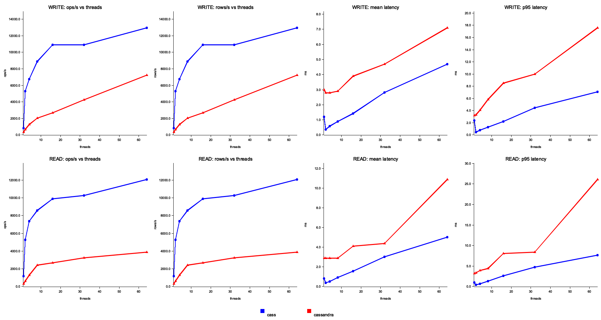

# Cass
[](https://github.com/mweiden/cass/actions/workflows/ci.yml) [](https://codecov.io/gh/mweiden/cass)

Toy/experimental clone of [Apache Cassandra](https://en.wikipedia.org/wiki/Apache_Cassandra) written in Rust, mostly using [OpenAI Codex](https://chatgpt.com/codex).

## Table of Contents

- [Features](#features)
- [Design tradeoffs](#design-tradeoffs)
- [Query Syntax](#query-syntax)
  - [Lightweight Transactions (Compare-and-Set)](#lightweight-transactions-compare-and-set)
- [Development](#development)
  - [Contributing](#contributing)
- [Storage Backends](#storage-backends)
  - [Local](#local)
  - [S3](#s3)
- [Example / Docker Compose Cluster](#example--docker-compose-cluster)
- [Consistency, Hinted Handoff, and Read Repair](#consistency-hinted-handoff-and-read-repair)
- [Maintenance Commands](#maintenance-commands)
- [Monitoring](#monitoring)
- [Performance Benchmarking](#performance-benchmarking)
- [Flamegraph Profiling](#flamegraph-profiling)

## Features

- **gRPC API and CLI** for submitting SQL queries
- **Data Structure:** Stores data in a [log-structured merge tree](https://en.wikipedia.org/wiki/Log-structured_merge-tree)
- **Storage:** Column-oriented SSTable placeholders with bloom filters and zone maps to speed up queries; persist to local or S3 AWS backends
- **Durability / Recovery:** Sharded write-ahead logs for durability and in-memory tables for parallel ingestion
- **Deployment:** Dockerfile and docker-compose for containerized deployment and local testing
- **Scalability:** Horizontally scalable
- **Gossip:** Cluster membership and liveness detection via gossip with health checks
- **Consistency:** Tunable read replica count with hinted handoff and read repair
- **Lightweight Transactions:** for compare and set operations

## Design tradeoffs

Like Cassandra itself, `cass` is an [AP system](https://en.wikipedia.org/wiki/CAP_theorem):

- **Consistency:** Consistency is relaxed, last-write-wins conflict resolution
- **Availability:** always writable, tunably consistent, fault-tolerant through replication
- **Partition tolerance:** will continue to work even if parts of the cluster cannot communicate

## Query Syntax

The built-in SQL engine understands a small subset of SQL:

- `INSERT` of a `key`/`value` pair into a table
- `UPDATE` and `DELETE` statements targeting a single key
- `SELECT` with optional `WHERE` filters, `ORDER BY`, `GROUP BY`,
  `DISTINCT`, simple aggregate functions (`COUNT`, `MIN`, `MAX`, `SUM`)
  and `LIMIT`
- Table management statements such as `CREATE TABLE`, `DROP TABLE`,
  `TRUNCATE TABLE`, and `SHOW TABLES`
- Lightweight transactions (compare-and-set):
  - `INSERT ... IF NOT EXISTS`
  - `UPDATE ... IF col = value` (simple equality predicates)
  - Returns a single row with `[applied]` and, on failure, the current values
    for the checked columns

Note on creating [partition and clustering keys](https://cassandra.apache.org/doc/4.0/cassandra/data_modeling/intro.html#partitions):
the first column in `PRIMARY KEY(...)` will be the partition key, subsequent columns will be indexed as clustering keys.

So for the example `id` will be the partition key and `c` will be a clustering key:

```
CREATE TABLE t (
   id int,
   c text,
   k int,
   v text,
   PRIMARY KEY (id,c)
);
```

### Lightweight Transactions (Compare-and-Set)

Cass supports [Cassandra-style lightweight
transactions](https://docs.datastax.com/en/cql-oss/3.3/cql/cql_using/useInsertLWT.html)
for conditional writes using a Paxos-like protocol across the partition's
replicas. Two forms are supported:

- `INSERT ... IF NOT EXISTS` — inserts only when the row does not exist.
- `UPDATE ... IF col = value [AND col2 = value2 ...]` — applies the update only
  if all equality predicates match the current row.

Response shape mirrors Cassandra:

- On success: a single row with `[applied] = true`.
- On failure: a single row with `[applied] = false` and the current values for
  the columns referenced in the `IF` clause.

Consistency for LWT is QUORUM and does not depend on the server's read
consistency setting. Normal reads continue to use the configured server-level
read consistency (ONE/QUORUM/ALL via `--read-consistency`).

Notes:

- The `IF` clause is parsed only when it appears as a trailing clause outside
  of quotes or comments (e.g., `-- comment`). Using the word "if" inside data
  values or identifiers does not trigger LWT behavior.

## Development

```bash
cargo test            # run unit tests
cargo run -- server  # start the gRPC server on port 8080
cargo run -- server --read-consistency one  # only one healthy replica required for reads
```

### Contributing

Before submitting changes, ensure the code is formatted and tests pass:

```bash
cargo fmt
cargo test
```

The project uses idiomatic Rust patterns with small, focused functions. See the
module-level comments in `src/` for a high-level overview of the architecture.

## Storage Backends

The server supports both local filesystem storage and Amazon S3.

### Local

Local storage is the default. Specify a directory with `--data-dir`:

```bash
cargo run -- --data-dir ./data
```

### S3

To use S3, set AWS credentials in the environment and provide the bucket
name:

```bash
AWS_ACCESS_KEY_ID=... AWS_SECRET_ACCESS_KEY=... \
  cargo run -- --storage s3 --bucket my-bucket
```

`AWS_REGION` controls the region (default `us-east-1`).


## Example / Docker Compose Cluster

With the server running you can insert and query data using gRPC. The provided `docker-compose.yml` starts a five-node cluster using local
storage with a replication factor of three where you can try this out.

Start the cluster:

```bash
docker compose up
```
Connect using the built-in REPL and run some queries:

```bash
$ cass repl http://localhost:8080

> CREATE TABLE orders (customer_id TEXT, order_id TEXT, order_date TEXT, PRIMARY KEY(customer_id, order_id))
CREATE TABLE 1 table
> INSERT INTO orders VALUES ('nike', 'abc123', '2025-08-25')
INSERT 1 row
> INSERT INTO orders VALUES ('nike', 'def456', '2025-08-26')
INSERT 1 row
> SELECT * FROM orders WHERE customer_id = 'nike'
  customer_id order_date  order_id
0 nike        2025-08-25  abc123
1 nike        2025-08-26  def456
(2 rows)
> SELECT COUNT(1) FROM orders WHERE customer_id = 'nike'
 count
0 2
(1 rows)
> SELECT * FROM orders WHERE customer_id = 'nike' AND order_id = 'abc123'
  customer_id order_date  order_id
0 nike        2025-08-25  abc123
(1 rows)

# Check-and-set (lightweight transaction) examples
> UPDATE orders SET order_date = '2025-08-27'
    WHERE customer_id = 'nike' AND order_id = 'abc123' IF order_date = '2025-08-25'
  [applied]
0 true
(1 rows)

> UPDATE orders SET order_date = '2025-08-28'
    WHERE customer_id = 'nike' AND order_id = 'abc123' IF order_date = '2025-08-25'
  [applied] order_date
0 false     2025-08-27
(1 rows)
```

## Consistency, Hinted Handoff, and Read Repair

Cass uses a coordinator-per-request model similar to Cassandra. Each statement
is routed to the partition's replicas using a Murmur3-based ring. The
coordinator enforces consistency and repairs divergence opportunistically:

 - Read consistency: configured per server with `--read-consistency {one|quorum|all}`.
   If there are not enough healthy replicas for the chosen level, the read fails.

- Hinted handoff: if a write targets replicas that are currently unhealthy, the
  coordinator writes to the healthy replicas and stores a “hint” for each
  unreachable replica (original SQL and timestamp). When a replica becomes
  healthy again, the coordinator replays the hints to bring it up to date. Hints
  are in-memory and best-effort (non-durable across coordinator restarts).

- Read repair: for non-broadcast reads, the coordinator gathers results from
  healthy replicas, merges by last-write-wins (timestamp), and returns the
  freshest value. If divergence is detected, it proactively repairs healthy
  stale replicas by sending the freshest value to them, and records hints for
  any replicas that are still down.

Tip: you can use `cass panic <node>` to temporarily mark a node as unhealthy and
observe hinted handoff and subsequent repair behavior when it recovers.

## Maintenance Commands

The CLI exposes helper commands useful during testing:

- `cass flush <node>` instructs the specified node to broadcast a flush to all
  peers.
- `cass panic <node>` forces the target node to report itself as unhealthy for
  60 seconds.

## Monitoring

Each node exposes Prometheus metrics on the gRPC port plus 1000 at
`/metrics` (for example, if the server listens on `8080`, metrics are
available on `9080`). The provided `docker-compose.yml` also starts
Prometheus and Grafana. After running

```bash
docker compose up
```

visit <http://localhost:3000> and sign in with the default
`admin`/`admin` credentials. The Grafana instance is preconfigured with the
Prometheus data source so you can explore metrics such as gRPC request
counts, peer health, RAM and CPU usage, and SSTable disk usage.

There is also a preconfigured dashboard with basic metrics from all instances. Screenshot below:


## Performance Benchmarking

The repository includes a simple harness for comparing write and read throughput of `cass` against a reference Apache Cassandra node.

```bash
scripts/perf_compare.sh         # runs both databases and stores metrics in ./perf-results
```

The script starts a three-node `cass` cluster and uses the example program `perf_client` to drive load. Metrics from the first `cass` node and `nodetool` statistics from Cassandra are written to the `perf-results` directory for analysis.

Current results (in comparison to Cassandra):



_5 nodes, replication factor 3, read consistency QUORUM, x axis is number of threads querying_

Current flamegraph for simple reads and writes:


_Single node_

## Flamegraph Profiling

Generate a CPU flamegraph for the query endpoint with a one-shot helper that runs the server under `cargo flamegraph` and drives load via the example perf client:

```bash
scripts/flamegraph_query.sh
```

Outputs an SVG under `perf-results/`, e.g. `perf-results/query_flamegraph_YYYYmmdd-HHMMSS.svg`.

Notes:
- Prereqs: `cargo install flamegraph`. On Linux, ensure `perf` is installed and accessible; on macOS, `dtrace` requires `sudo` and may require Developer Mode.
- Tunables via env vars: `NODE` (default `http://127.0.0.1:8080`), `OPS` (default `10000`), `THREADS` (default `32`), `OUTDIR` (default `perf-results`), and `EXTRA_SERVER_ARGS` to pass through to `cass server`.
